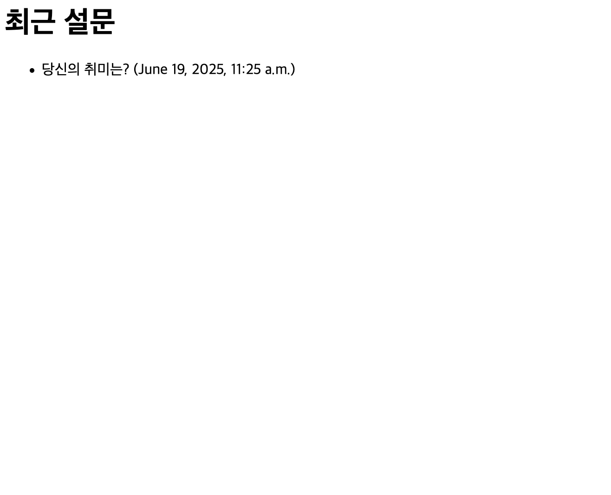

## 📌 파이썬 설치
```bash
# 파이썬 설치
brew install python3

# 버전 확인
$ python3 --version # Python 3.13.5
```

## 📌 가상환경 구축
파이썬 라이브러리 충돌 방지를 위한 독립된 가상환경 필요
```bash
# 프로젝트 생성
mkdir django_project
cd django_project

# 가상환경 구축 및 실행
python3 -m venv venv
source bin/activate

# 가상환경 종료
deactivate
```

## 📌 Django 생성
```bash
# django 설치
pip3 install django

# 프로젝트 생성
django-admin startproject proj01
cd proj01

# 서버 구동
python3 manage.py runserver
```

## 📌 4. Django 파일 구조
```bash
proj01/
	manage.py
	proj01/
		__init__.py
		settings.py
		urls.py
		asgi.py
		wsgi.py
```

- `proj01/`: 프로젝트 루트
- `manage.py`: Command Line Utility
- `__init__.py`: 파이썬 패키지로 만들기 위한 파일
- `settings.py`: Django 설정 파일
- `urls.py`: URL 라우팅 및 뷰 매핑 설정
- `asgi.py`: ASGI 서버 설정 (비동기 서버 환경 파일)
- `wsgi.py`: WSGI 서버 설정 (동기 서버 환경 파일)

## 📌 앱 생성
```bash
python3 manage.py startapp polls
```
앱이란, Django 프로젝트 내에서 하나의 기능 또는 모듈을 담당하는 독립적인 단위이다. 예를 들어 설문조사 앱인 polls 앱을 생성시,

```bash
polls/
    __init__.py
    admin.py
    apps.py
    models.py
    tests.py
    views.py
```

- `__init__.py`: 파이썬 패키지로 인식하기 위한 파일
- `admin.py`: Django 관리자 페이지에서 사용할 모델 설정
- `apps.py`: 앱 설정 파일
- `models.py`: 데이터베이스 모델 정의
- `tests.py`: 앱에 대한 테스트 정의
- `views.py`: HTTP 요청을 처리할 뷰 함수 정의

## 📌 polls 앱 코드 작성
`polls/urls.py` 생성

```python
from django.urls import path
from . import views

urlpatterns = [
    path('', views.index, name='index'),
]
```

`polls/models.py` 예시:

```python
from django.db import models

class Question(models.Model):
    question_text = models.CharField(max_length=200)
    pub_date = models.DateTimeField('date published')

    def __str__(self):
        return self.question_text

class Choice(models.Model):
    question = models.ForeignKey(Question, on_delete=models.CASCADE)
    choice_text = models.CharField(max_length=200)
    votes = models.IntegerField(default=0)

    def __str__(self):
        return self.choice_text
```

`polls/views.py` 예시:

```python
from django.shortcuts import render
from .models import Question

def index(request):
    latest_question_lsit = Question.objects.order_by('-pub_date')[:5]
    context = {'latest_question_list': latest_question_list}
    return render(request, 'polls/index.html', context)
```

`polls/templates/polls/index.html` 생성:
```html
<h1>최근 설문</h1>
<ul>
    
        <li>{{ question.question_text }} ({{ question.pub_date }})</li>
    
        <li>설문이 없습니다.</li>
    
</ul>
```

`proj01/urls.py` 에서:

```python
from django.contrib import admin
from django.urls import path, include

urlpatterns = [
    path('admin/', admin.site.urls),
    path('polls/', include('polls.urls')),
]
```

## 📌 polls 실행
1. `models.py`에 새로운 모델을 추가
2. 터미널에서:
```bash
python3 manage.py makemigrations
python3 manage.py migrate
```
3. 데이터베이스에 새로운 테이블이 생성됨

이 후 실행하면 된다.
```bash
python3 manage.py runserver
```

## 📌 결과 화면


```toc

```