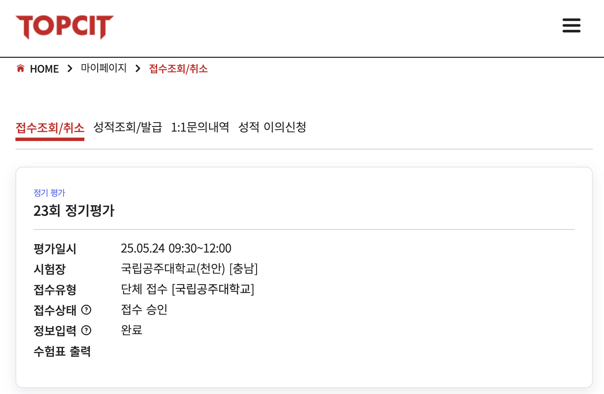
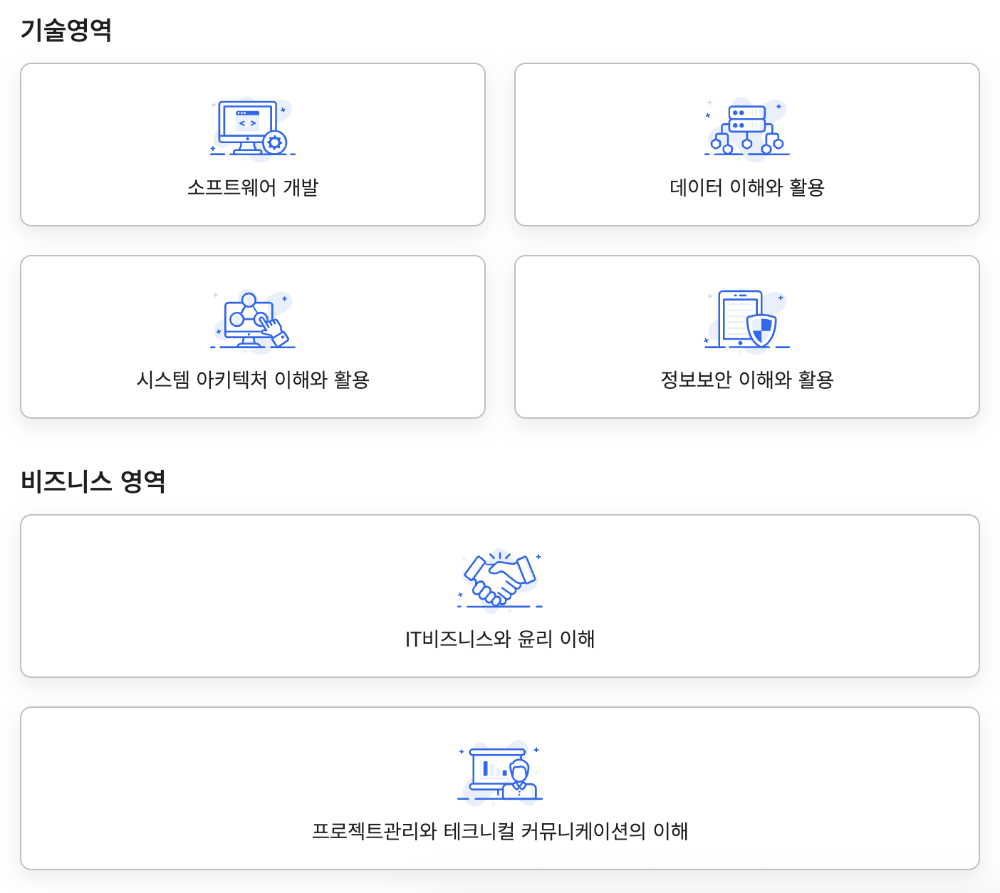
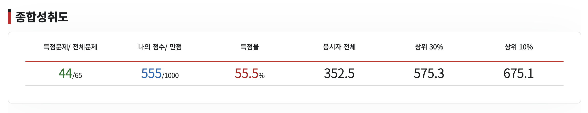
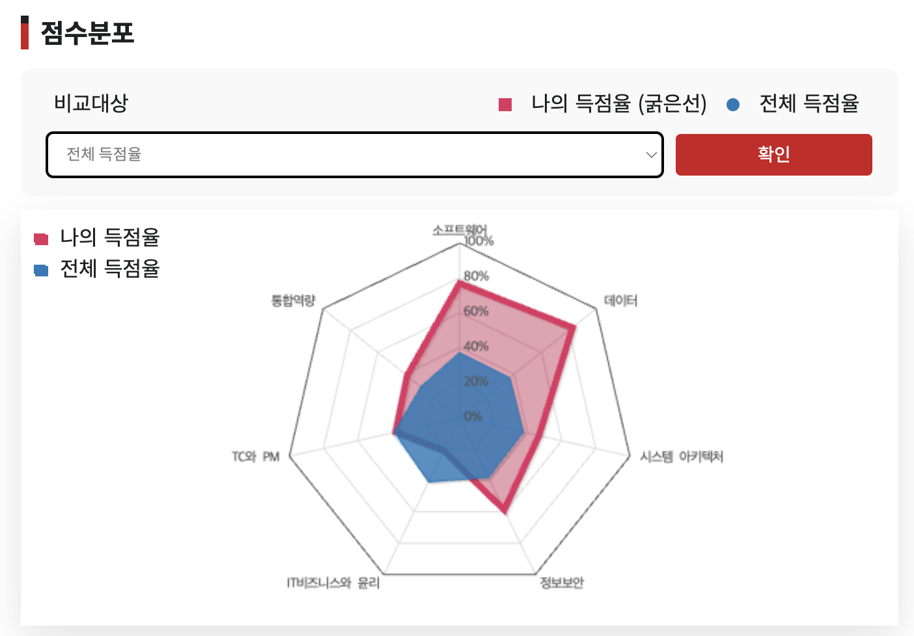
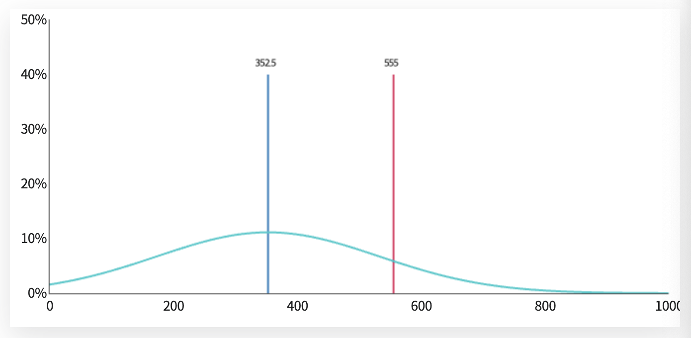

## 📌 TOPCIT이란 무엇인가?
TOPCIT(Top-class IT Citizenship Test)은 IT 분야의 실력 평가 시험으로, 주로 정보기술 관련 자격증이나 취업을 준비하는 사람들에게 중요한 시험입니다. `한국정보기술진흥원`에서 진행되며, IT 인재의 역량을 측정하기 위한 다양한 문제들을 다룹니다.

---

## 📌 시험 목적과 중요성
시험 목적은 다음과 같습니다.
1. **IT 역량 평가**: IT 기술에 대한 기본적인 이해와 문제 해결 능력을 평가
2. **취업 및 자격증**: IT 관련 직무나 자격증 취득 시 유용하게 활용
3. **산업 맞춤형 평가**: 실제 업무 현장에서의 문제 해결 능력을 평가

TOPCIT을 보는 이유는 다음과 같습니다.
1. **취업 준비**: IT 기업에서 이력서에 이 시험 결과를 반영할 수 있어 취업 시 유리하게 작용할 수 있습니다.
2. **자기계발**: IT 실력 향상을 위한 자기 계발의 일환으로 도전할 수 있습니다.
3. **자격증 취득**: 일부 기관에서는 TOPCIT 결과를 기준으로 자격증을 발급하기도 합니다.

---

## 📌 준비 과정 (짧게, 베이스)
우선 저는 처음 접해보는 시험입니다. 학교에서 진행하는 SW 사업단에서 연 1회 TOPCIT 필수 응시라고 하였고, 심지어 응시료도 지원해주었기에 제 역량을 알고 싶어 지원하였습니다. 

제 현재 베이스는 아래와 같습니다.
- 소프트웨어학과 3학년
- 기본적인 c, java, python 지식
- CS 관련 수업 지식 (소프트웨어공학, 데이터베이스, 네트워크, 운영체제 등)
- 정보처리기능사/산업기사/기사를 취득

저는 현재 제가 어느 부분이 부족한지, 그리고 제 수준이 어느정도인지 알고 싶었기 때문에 따로 공부하지 않고 시험을 보았습니다.

---

## 📌 시험 구성 및 과목 소개
TOPCIT 시험은 온라인 시험이며 일반적인 CBT 시험처럼 컴퓨터에 답안을 작성하고 제출하면 됩니다. 문제 유형은 객관식, 주관식, 서술형, 실습 문제가 있습니다.

과목은 크게 **기술 영역**, **비즈니스 영역**으로 나뉩니다.



---

## 📌 시험 당일
시험을 준비하지 않은 채로 치른 이번 자격증 시험에서, 제 현재 역량을 점검하고 부족한 점을 확인하고자 했습니다. 시험 당일 아침까지도 시험을 치러야 한다는 긴장감 없이, 오히려 편안한 마음으로 시험 장소로 향했습니다. 다른 자격증 시험들과는 달리, 비교적 차분한 상태에서 시험을 볼 수 있었고 덕분에 시험 문제를 헷갈리지 않고, 제 지식을 온전히 발휘할 수 있었습니다.

---

## 📌 시험 후기 및 난이도 분석


난이도는 다양했습니다. 기본적인 문제도 많았고 어려운 문제는 저에게 너무나 어려웠습니다. 다이어그램이나 ERD 작성이 정말 어려웠지만 최대한 지식을 활용해서 작성하였습니다.




소프트웨어와 데이터 영역에서는 나쁘지 않은 성적을 거두었지만, 그 외의 영역에서는 아쉬운 점수를 받았습니다. 이는 제게 아직 부족한 부분이 많다는 것을 의미하며, 어떤 부분을 집중적으로 공부해야 할지 확실히 알게 된 기회였습니다. 특히, 평균보다 낮은 점수를 받은 비즈니스 영역은 매우 아쉬웠습니다. 이는 실무 경험이 부족하다는 것을 뜻하며, 앞으로 가장 중요한 부분으로 생각해야 할 영역이 아닐까 합니다.

---

## 📌 마무리 및 결론
처음에는 아무것도 모른 채 시작한 시험이었지만, 예상 외로 정말 많은 것을 얻을 수 있는 기회였습니다. 이번 경험을 통해 제 부족한 부분을 더욱 보완하고, 다음 시험에서는 지금보다 더 나은 성적을 거둘 수 있도록 준비할 생각입니다. 이를 위해 필요한 부분을 체계적으로 공부하고, 실무 경험을 쌓아나가는 것이 중요하다는 것을 느꼈습니다.

```toc

```