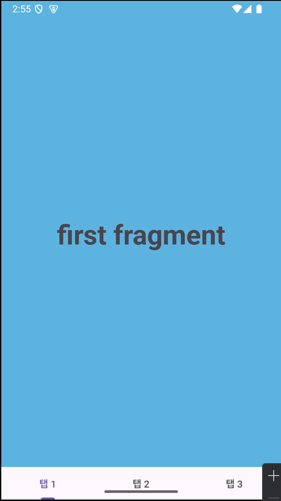
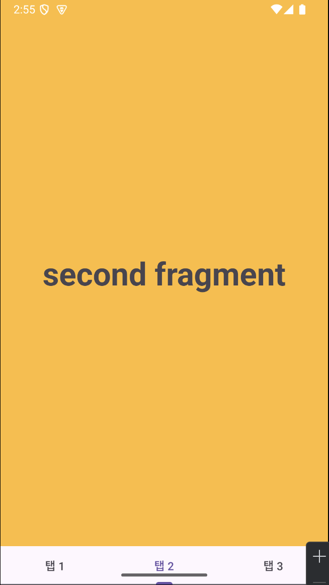
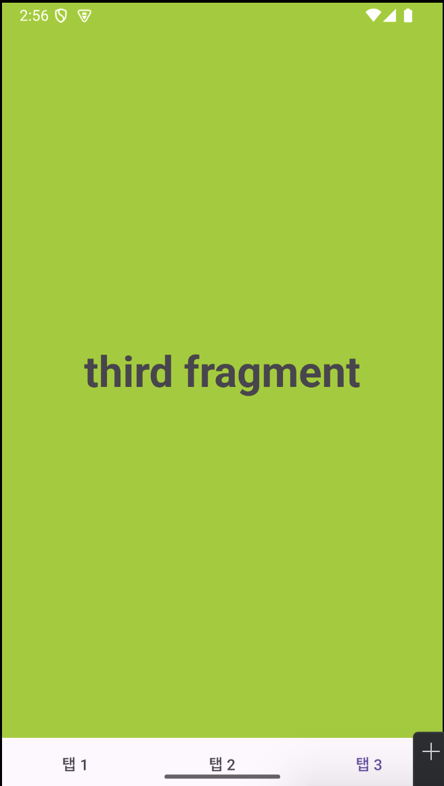

## 📌 TabLayout, ViewPager2 란?
> ViewPager2 : 좌우로 화면을 밀어 페이지를 전환할 수 있는 뷰\
TabLayout : ViewPager2와 연동하여 ViewPager2의 페이지들을 메뉴처럼 사용할 수 있다.

## 📌 frag1~3.xml 구현
> 구현 테스트를 위해 fragment page 3개를 각각 다른 색으로 작성하였다.\
android:text는 각각 first, second, third이다. 

```xml
<?xml version="1.0" encoding="utf-8"?>
<LinearLayout xmlns:android="http://schemas.android.com/apk/res/android"
    android:layout_width="match_parent"
    android:layout_height="match_parent"
    android:orientation="vertical"
    android:background="@android:color/holo_blue_light">
    
    <TextView
        android:layout_width="match_parent"
        android:layout_height="match_parent"
        android:text="first fragment"
        android:textSize="40sp"
        android:textStyle="bold"
        android:gravity="center"/>
</LinearLayout>
```

## 📌 frag1~3.java 구현
> fragment xml로 레이아웃을 구성하였으니 이제 화면에 띄워야 한다.\
inflator는 xml을 객체화 시켜 화면에 띄우는 용도이다. 탭을 누르면 화면이 전환되게 하는 기능이다.\
R 파일 내부의 Layout에서 xml을 넣고, 뷰를 띄울 컨테이너를 찾는다. attachtoroot 기능은 false 처리한다. 

```java
package com.cookandroid.mobile_project;

import android.os.Bundle;
import android.view.LayoutInflater;
import android.view.View;
import android.view.ViewGroup;

import androidx.annotation.NonNull;
import androidx.annotation.Nullable;
import androidx.fragment.app.Fragment;

public class frag1 extends Fragment {
    @Nullable
    @Override
    public View onCreateView(@NonNull LayoutInflater inflater, @Nullable ViewGroup container, @Nullable Bundle savedInstanceState) {
        return inflater.inflate(R.layout.frag1, container, false);
    }
}
```

## 📌 Fragment Adapter 구현
> 이제 fragment 들을 관리할 Adapter가 필요하다.\
addFragment 함수는 외부에서 이 함수를 통해 fragmentList에 fragment를 넣을 수 있게 한다.

```java
package com.cookandroid.mobile_project;

import androidx.annotation.NonNull;
import androidx.fragment.app.Fragment;
import androidx.fragment.app.FragmentActivity;
import androidx.fragment.app.FragmentManager;
import androidx.viewpager2.adapter.FragmentStateAdapter;

import java.util.ArrayList;
import java.util.List;

public class FragmentAdapter extends FragmentStateAdapter {

    private List<Fragment> fragmentList = new ArrayList<>();

    // FragmentActivity나 AppCompatActivity를 통해 초기화
    public FragmentAdapter(@NonNull FragmentActivity fragmentActivity) {
        super(fragmentActivity);
    }

    // Fragment 추가 메소드
    public void addFragment(Fragment fragment) {
        fragmentList.add(fragment);
    }

    @NonNull
    @Override
    public Fragment createFragment(int position) {
        // 해당 position의 fragment를 반환
        return fragmentList.get(position);
    }

    @Override
    public int getItemCount() {
        return fragmentList.size();
    }
}
```

## 📌 MainActivity 구현
> 이제 마지막으로 Adapter에서 만든 addFragment 함수를 이용해 fragment를 리스트 내부에 집어넣고,\
set 함수를 통해 ViewPager와 FragmentAdapter, TabLayout을 연결한다.

```java
package com.cookandroid.mobile_project;

import android.app.TabActivity;
import android.os.Bundle;
import android.widget.TabHost;

import androidx.activity.EdgeToEdge;
import androidx.appcompat.app.AppCompatActivity;
import androidx.core.graphics.Insets;
import androidx.core.view.ViewCompat;
import androidx.core.view.WindowInsetsCompat;
import androidx.viewpager2.widget.ViewPager2;

import com.cookandroid.mobile_project.R;
import com.google.android.material.tabs.TabLayout;
import com.google.android.material.tabs.TabLayoutMediator;

public class MainActivity extends AppCompatActivity {

    @Override
    protected void onCreate(Bundle savedInstanceState) {
        super.onCreate(savedInstanceState);
        setContentView(R.layout.activity_main);

        // ViewPager2, TabLayout 초기화
        ViewPager2 viewPager = findViewById(R.id.viewPager);
        TabLayout tabLayout = findViewById(R.id.tabLayout);

        // FragmentAdapter에 Fragment 추가
        FragmentAdapter fragmentAdapter = new FragmentAdapter(this);
        fragmentAdapter.addFragment(new frag1());
        fragmentAdapter.addFragment(new frag2());
        fragmentAdapter.addFragment(new frag3());

        // ViewPager2에 FragmentAdapter 설정
        viewPager.setAdapter(fragmentAdapter);

        // TabLayout, ViewPager2 연결
        new TabLayoutMediator(tabLayout, viewPager, (tab, position) -> {
            switch (position){
                case 0:
                    tab.setText("탭 1");
                    break;
                case 1:
                    tab.setText("탭 2");
                    break;
                case 2:
                    tab.setText("탭 3");
                    break;
            }
        }).attach();
    }
}
```

## 📌 결과 화면
<p align="center">
  
  
  
</p>

```toc
```