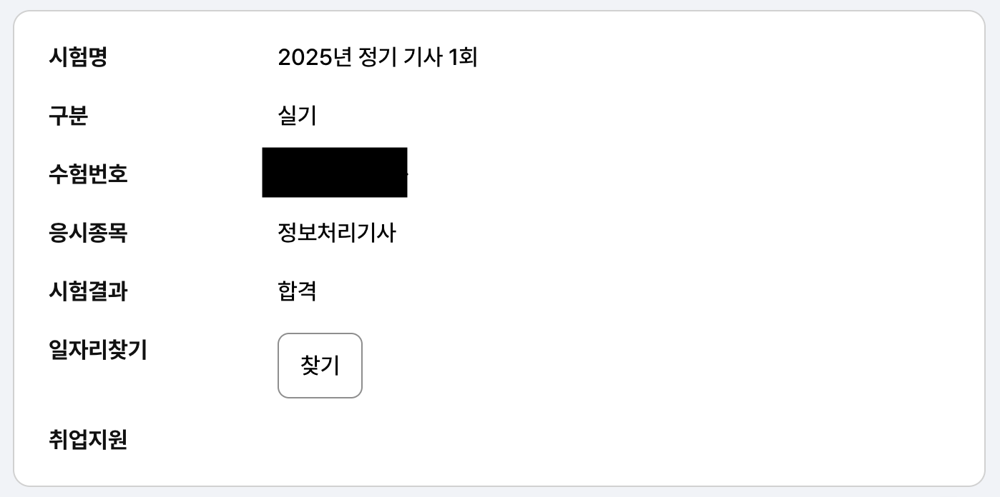

## 📌 1. 개요
2025년 정보처리기사를 합격했습니다 🎉🎉





우선 제 베이스는
```
1. 소프트웨어학과 3학년
2. 기본적인 C, Python, Java, 데이터베이스 지식
3. 정보처리 기능사/산업기사 취득
입니다.
```

## 📌 2. 도전 배경
도전을 하게 된 이유는 저희 학교의 졸업 요건이기도 하고, 수업내용과 동일해서 학교 시험과 자격증 시험을 병행할 수 있겠다 싶어 신청을 하게 되었습니다.

아시다시피 기사 자격요건은 4학년 이상인데, 저는 군대에 전산병으로 입대하여 실무 경력이 인정되었고, 안에서 정보처리산업기사를 취득하였기 때문에 `정보처리산업기사 + 실무 경력 1년`이 성립되어 자격 요건이 충족되었습니다.

저와 같은 상황인 분들은 한국산업인력공단에 병적 증명서를 제출하면 됩니다.
자세한 내용은 블로그에 따로 작성하겠습니다. 참고바랍니다!

## 📌 3. 준비 과정
```
2025.01.13 : 정보처리기사 필기 신청

2025.02.03 ~ 2025.02.26 : 약 3주간 공부
1주 : 인터넷에 올라온 시나공 필기 기출문제 3년치 1회독
2주 : 기출문제 복습 및 2회독
3주 : 필기 요약집 1회독

2025.02.27 : 정보처리기사 필기
```

필기는 약 3주간 하루 2~3시간씩만 투자하였습니다. <br>
여담으로 필기 접수 이틀전에 라섹을 하여 선글라스를 끼고 얼굴을 화면 가까이 댄 상태로 혼자 힘겹게 신청을 했습니다 ㅋㅋㅋㅋ<br>
필기 보러간 날에도 병원이 근처라 시험 끝나고 눈 상태보러 갔다왔답니다.

```
2025.03.24 : 정보처리기사 실기 신청

2025.04.13 ~ 2025.04.19 : 1주간 공부
- 인터넷 정보처리기사 실기 복원 문제
  20년도 ~ 24년도 기출문제 2회독
- 실기 족보 1,2,3탄 정리/요약본 1회독

2025.04.20 : 정보처리기사 실기
```

실기는 7일동안 하루 3~4시간씩 투자하여 코딩 위주로 공부하였습니다.<br>
공부한 사이트는 https://chobopark.tistory.com/540 입니다.

필기에 비해 상대적으로 적은 준비기간인 이유는 접수 이후에 예비군과 이것저것 하느라 늦게 시작했습니다. 또, 학교 중간고사 기간과 겹치는 바람에 많은 양을 공부하다보니 시간이 부족했습니다.

## 📌 4. 시험 정보
정보처리기사 필기의 과목은 총 5과목으로,
- 소프트웨어 설계
- 소프트웨어 개발
- 데이터베이스 구축
- 프로그래밍 언어 활용
- 정보시스템 구축 관리

가 있습니다. 소프트웨어 설계와 개발은 이해 위주의 공부를 하였고, 정보시스템 구축 관리는 모르는 용어가 많아 암기식으로 공부하였습니다.
데이터베이스와 프로그래밍 언어는 기본 지식이 있었기에 깊게 공부하지 않고 각 문제의 코드를 이해하고 넘어갔습니다.

난이도는 다른 기사 과목에 비해 쉬운 편이라고 알려진 만큼, 그렇게 어렵진 않았습니다. 비전공자도 한 달 정도 공부하면 충분히 합격하실 정도의 난이도였습니다.

하지만 실기는 거의 코딩 위주의 시험이었습니다. 생각보다 복잡한 문제도 많았고 시간도 오래 걸리는 문제들이었기에 비전공자의 경우, 실기는 깊게 공부하고 가는게 좋을 듯 싶습니다. 기본 베이스가 있으신 분들은 충분히 하실 수 있다고 생각합니다.

응시료는

- 필기 19,400원
- 실기 22,600원

인데 저는 필기를 `청년 자격시험 응시료 지원사업`을 통해 반값 할인된 9,700원에 봤습니다.
실기도 마찬가지로 11,300원에 시험을 보았고, 이후 학교에서 진행하는 응시료 지원 사업을 더해 약 8,000원에 시험을 보았습니다.

## 📌 5. 시험 후기
필기는 `TIEC GangNam 테라에듀넷 1실`에서 봤습니다.
교대역 근처 5분 거리이고, 오르막길로 가다보면 건물 앞에 자격증 시험 안내 간판이 있고, 지하로 내려가서 시험을 봤습니다.
이 곳은 대기실이 작았기에 저를 포함한 대부분의 사람들은 서서 공부하거나 바닥에 앉아서 마무리 공부를 했습니다.

실기는 `상명대학교 천안캠퍼스 한누리관`에서 봤습니다.
학교 안으로 깊게 올라가야해서 살짝 힘들었습니다.. 그래도 뷰는 좋더군요. 이 곳은 대기실도 로비라 크고 시험장 안에서도 공부할 수 있는 환경이어서 편하게 앉아서 마무리 정리를 했습니다.

## 📌 6. 회고 및 느낀 점
가장 잘한 점과 아쉬운 점을 얘기해보자면,
잘한 점은 군대에서 자격 요건을 맞추고 나왔다는 점입니다. 남성분들의 경우 대부분 군대를 다녀오시기에 이왕 갔다오는거 자격 요건을 맞추고 나오는게 좋다고 생각합니다.

아쉬운 점이 있다면 대학교 시험과 겹치는 일정을 잡는 바람에 둘 다 잘 볼 수 있었던 것을 둘 다 이도저도 아닌 애매한 점수를 받은 게 아닐까 싶습니다. 하지만 저는 공부머리가 아닌 편이기 때문에, 다른 분들은 충분히 병행해서 취득할 수 있을 거라고 생각합니다.

제 인생 처음으로 기사 자격증이라는 것을 취득해 보았는데, 아직 많이 부족하고 배우고 공부할게 많지만 괜히 막 전문가가 된 것 같습니다 ㅋㅋㅋ 아직 배우고 싶은게 너무 많아서 1학기 종강하고 AWS 개발 과정을 들을 예정입니다. 저는 보안 쪽이 재미있지만 웹 개발도 알아두어야 한다고 생각하기 때문에 굉장히 설렙니다.
AWS 과정을 이수하면 그 때 블로그로 다시 찾아뵙겠습니다. 그리고 조만간 정보보안기사도 공부할 예정입니다. 이 때도 찾아뵐테니 응원해주세요 ☺️

긴 글 읽어주셔서 감사드리고 이 글을 찾아오신 여러분들도 기사 자격증이나 다양한 도전에 성공하시기를 바라면서 이만 글을 마치도록 하겠습니다. 응원합니다 😁

```toc
```